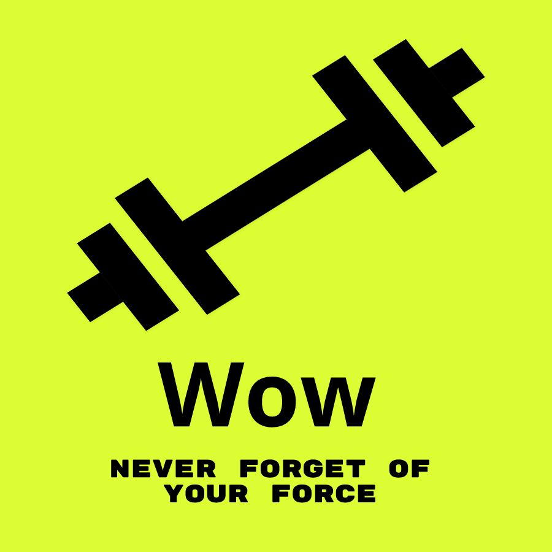

<h1>WayOftheWeights-FRONT-END 🏋🏽‍♂️<h1>

### Indice 👨‍💻

 <li> <a href="#introdução">1 - 🚪Introdução</a> •</li>
 <li> <a href="#desenvolvimento">2 - ⚙️ Desenvolvimento e Tecnologias</a> • </li>
 <li> <a href="#instalar">3 - 👇🤘 Como instalar</a> • </li>
 <li> <a href="#usar">4 - 🤘Como Usar</a> • </li>
 <li> <a href="#consideraçoesfinais">5 - Considerações finais </a> • </li>
 <li> <a href="#autor">6 -🧑‍💻 Autor</a> • </li>
 <li> <a href="#licensa"> 7- Licença</a> • </li>

## Edições ✏️📑

|             Alterações             |   Data   | Versão |
| :--------------------------------: | :------: | :----: |
| Emissão Inicial | 31/10/22 | 1.0.1  |

<h2 id='introdução' color=green ><b>1 - Introdução</b></h2>

Esse é um front-end de uma aplicação, voltada para academia e gestão de exercicios e treios, com foco na evolucão de ganhos de forca do usuário.

<h2 id='desenvolvimento'><b>2- Desenvolvimento e Tecnologias 🥵🧑‍🏭 </b></h2>

Não tive trabalhos para realizar essa aplicação tem uma, creio foi um dos melhores front-end que já criei, se não o melhor tirando algumas coisa inputs repitidos e não convertidos em componentes __Way of the Weights__ tem uma das melhores validação de dados de inputs que já creio, claro com
o auxilio do **react hook form**, uma biblioteca excelente para tal.

### 👥 Principais Tecnologia usadas até o momento

**• Typescript**
**• React**
**• React-hook-forms**
**• Recharts**

<h2 id='instalar'><b>3- Como instalar 🧑‍🔧</b></h2>

1. Clone o projeto
1. Digite npm start no ambiente de desenvolvimento ou npm run build para rodar o projeto.

<h2 id='usar'><b>4- Como usar 👩‍💻</b></h2>

<h3>👉🏽<a href='https://way-of-the-weights-front-end.vercel.app'>Clique aqui crie seu usuario para testar em tempo real</a></h3>

Em breve ensinarei com usar.....

<h2 id='consideraçoesfinais'><b>5 -🥺😭 Considerações finais</b></h2>

Ahhh, mas você já vai ir embora 😢 ...

Esse projeto foi voltado para o acompanhamento da evolução da força do Usuário que pratica algum esporte físico.
O codigo foi melhorado ao máximo. Amei usar a biblioteca **React-hook-form** no front-end.

### Autor ✍🏻

 <b>Joao Guilherme</b></h4> <a href="https://github.com/JoaoG23/">🚀</a>

Feito com 🤭 por Joao Guilherme 👋🏽 Entre em contato!

<h2 id='licenca'><b>7 - Licença</b></h2>

